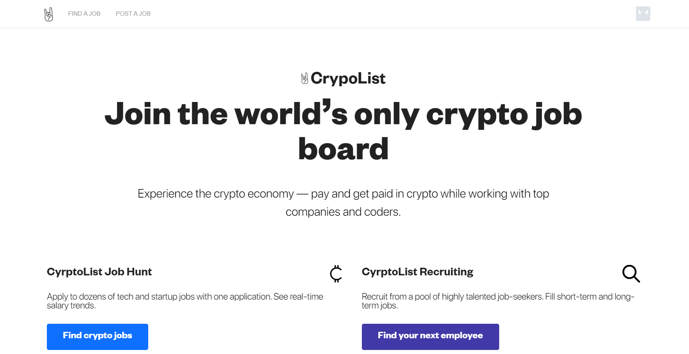
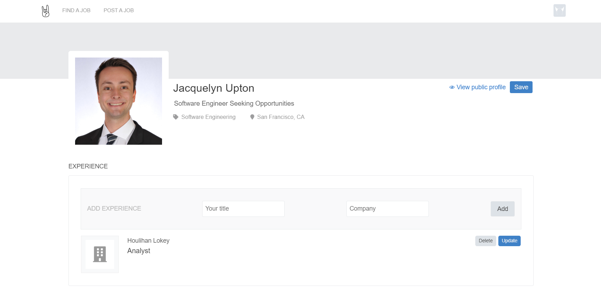
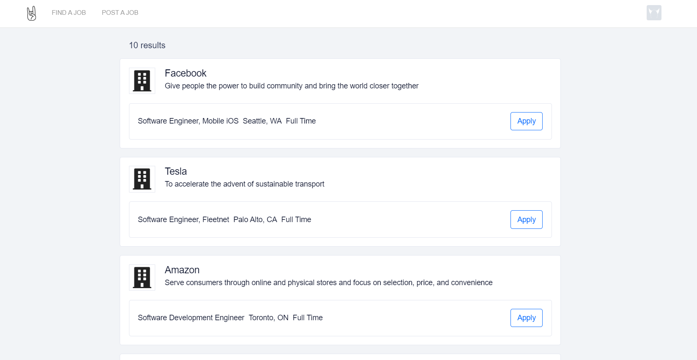
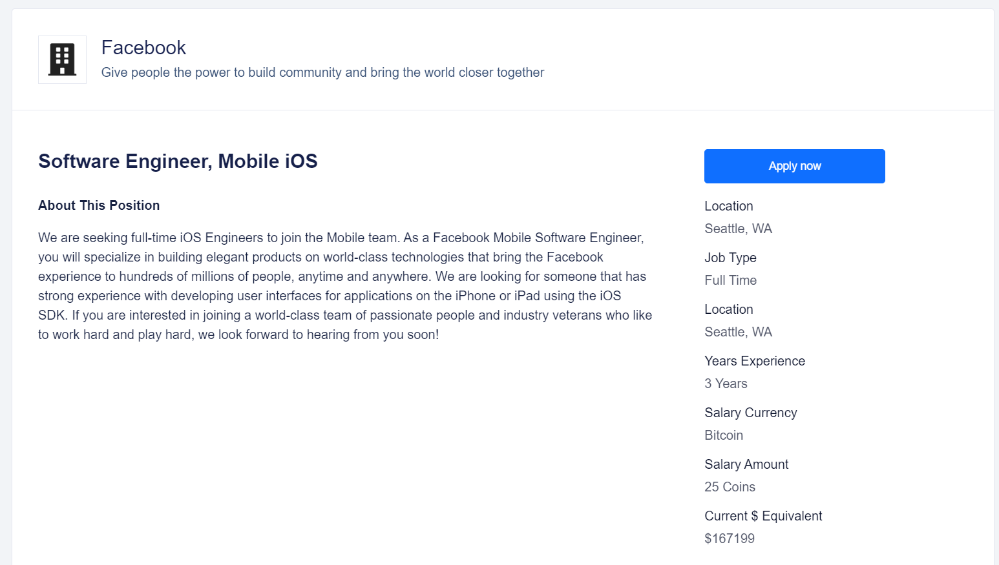
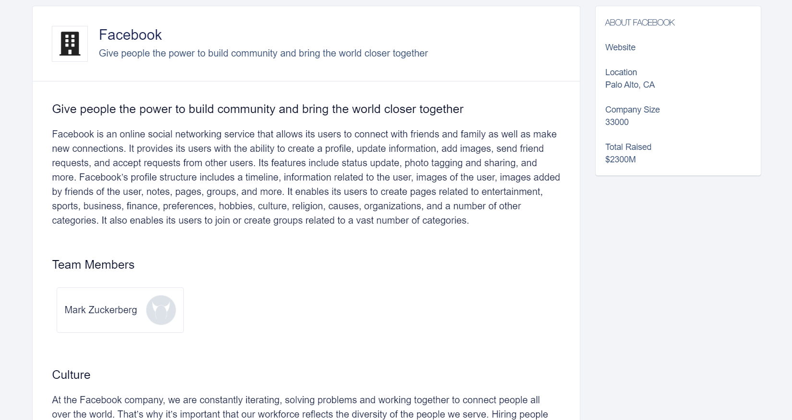

# CryptoList
[Live Demo](https://aa-crypto-list.herokuapp.com/#/)

CryptoList, an AngelList clone, is a platform that allows users to post and apply for jobs that pay in crypto. Users may create and customize personal and company profiles to attract employers and employees alike.

This project makes use of Rails / PostgreSQL on the backend and React / Redux on the frontend. It was designed and built within a 10-day timeframe.

#### Features
* Secure frontend to backend user authentication using BCrypt
* Users can setup profiles and seemlessly add, update and remove work experiences, project links, and degrees
* Users can add profile pictures, stored / accessed via AWS S3
* Users can create companies, linking employees, adding perks and listing investors
* Users can create, view, and apply to job positions
* CoinMarketCap API affords real-time pricing data on crypto currency for top coins

#### Screenshots

